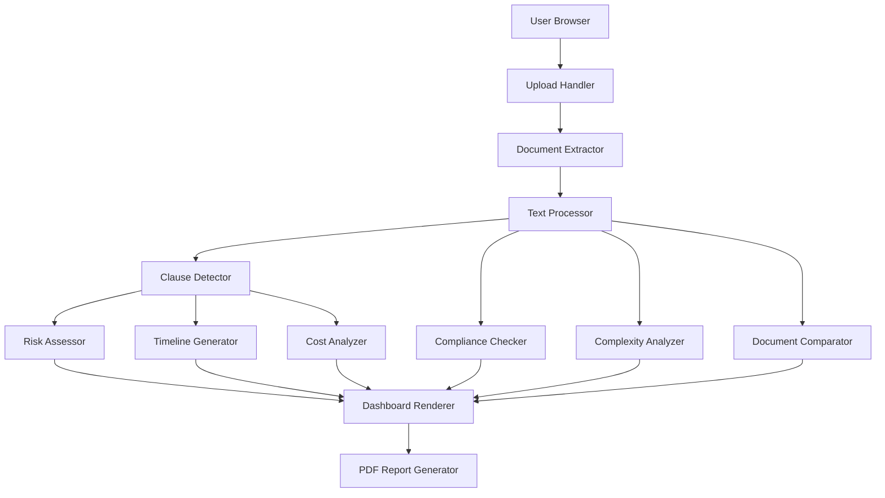

# Design Document

## Overview

The Legal/Contract Summary Dashboard is a web-based application that provides automated analysis of legal documents. The system follows a pipeline architecture where documents flow through extraction, analysis, risk assessment, and visualization stages. The frontend presents results through an interactive dashboard with charts, timelines, and downloadable reports.

The application is designed as a client-side focused tool with minimal backend requirements, leveraging browser capabilities for document processing and visualization. The architecture emphasizes modularity, allowing each analysis component to operate independently while contributing to a unified dashboard view.

## Architecture

### High-Level Architecture



### Component Layers

1. **Presentation Layer**: React-based UI components for dashboard, charts, and interactions
2. **Analysis Layer**: Core business logic for clause detection, risk assessment, and compliance checking
3. **Processing Layer**: Document extraction and text processing utilities
4. **Data Layer**: In-memory state management for document data and analysis results

### Technology Stack

- **Frontend Framework**: React with TypeScript
- **State Management**: React Context API or Zustand
- **Document Processing**: 
  - PDF: pdf.js or pdf-parse
  - DOCX: mammoth.js or docx-parser
- **Visualization**: Chart.js or Recharts (with interactive features: hover tooltips, click filtering, zoom/pan)
- **PDF Generation**: jsPDF with html2canvas
- **Styling**: Tailwind CSS or Material-UI
- **Testing**: Jest for unit tests, fast-check for property-based testing

## Components and Interfaces

### 1. Document Upload Handler

**Responsibility**: Validate and process uploaded files

**Interface**:
```typescript
interface UploadHandler {
  validateFile(file: File): ValidationResult;
  processUpload(file: File): Promise<DocumentMetadata>;
  sanitizeFile(file: File): Promise<File>;
}

interface ValidationResult {
  isValid: boolean;
  error?: string;
}

interface DocumentMetadata {
  fileName: string;
  fileSize: number;
  fileType: 'pdf' | 'docx';
  uploadTimestamp: Date;
}
```

### 2. Document Extractor

**Responsibility**: Extract text from PDF and DOCX files

**Interface**:
```typescript
interface DocumentExtractor {
  extractFromPDF(file: File): Promise<ExtractedText>;
  extractFromDOCX(file: File): Promise<ExtractedText>;
}

interface ExtractedText {
  content: string;
  paragraphs: string[];
  metadata: {
    pageCount: number;
    characterCount: number;
  };
}
```

### 3. Text Processor

**Responsibility**: Clean and normalize extracted text

**Interface**:
```typescript
interface TextProcessor {
  removeHeaders(text: string): string;
  removeFooters(text: string): string;
  removePageNumbers(text: string): string;
  normalizeParagraphs(text: string): string;
  cleanWhitespace(text: string): string;
}
```

### 4. Clause Detector

**Responsibility**: Identify and categorize contract clauses

**Interface**:
```typescript
interface ClauseDetector {
  detectClauses(text: string): Clause[];
  categorizeClause(clause: string): ClauseCategory;
}

interface Clause {
  title: string;
  content: string;
  startIndex: number;
  endIndex: number;
  category: ClauseCategory;
}

type ClauseCategory = 
  | 'parties'
  | 'effective_date'
  | 'duration'
  | 'payment'
  | 'confidentiality'
  | 'termination'
  | 'penalties'
  | 'dispute_resolution'
  | 'governing_law'
  | 'responsibilities'
  | 'non_compete'
  | 'non_solicitation'
  | 'other';
```

### 5. Risk Assessor

**Responsibility**: Evaluate risk levels for clauses

**Interface**:
```typescript
interface RiskAssessor {
  assessClause(clause: Clause): RiskAssessment;
  generateRiskMap(clauses: Clause[]): RiskMap;
}

interface RiskAssessment {
  clause: Clause;
  riskLevel: 'high' | 'medium' | 'low';
  reason: string;
}

interface RiskMap {
  high: RiskAssessment[];
  medium: RiskAssessment[];
  low: RiskAssessment[];
}
```

### 6. Compliance Checker

**Responsibility**: Validate presence and quality of critical clauses

**Interface**:
```typescript
interface ComplianceChecker {
  checkCompliance(clauses: Clause[]): ComplianceIssue[];
}

interface ComplianceIssue {
  issue: string;
  severity: 'high' | 'medium' | 'low';
  details: string;
  recommendation?: string;
}
```

### 7. Complexity Analyzer

**Responsibility**: Calculate document complexity score

**Interface**:
```typescript
interface ComplexityAnalyzer {
  calculateScore(text: string, clauses: Clause[]): ComplexityScore;
}

interface ComplexityScore {
  score: number; // 0-100
  label: 'simple' | 'moderate' | 'complex';
  metrics: {
    avgSentenceLength: number;
    jargonDensity: number;
    clauseCount: number;
    nestedClauseCount: number;
    penaltySeverity: number;
  };
}
```

### 8. Timeline Generator

**Responsibility**: Create visual timeline from contract dates

**Interface**:
```typescript
interface TimelineGenerator {
  generateTimeline(clauses: Clause[]): Timeline;
}

interface Timeline {
  startDate?: Date;
  endDate?: Date;
  renewalTerms?: string;
  milestones: TimelineMilestone[];
}

interface TimelineMilestone {
  date: Date;
  label: string;
  type: 'start' | 'end' | 'renewal' | 'milestone';
}
```

### 9. Cost Analyzer

**Responsibility**: Extract and categorize financial information

**Interface**:
```typescript
interface CostAnalyzer {
  analyzeCosts(clauses: Clause[]): CostBreakdown;
}

interface CostBreakdown {
  oneTimeCosts: CostItem[];
  recurringCosts: CostItem[];
  fees: CostItem[];
  total: number;
}

interface CostItem {
  description: string;
  amount: number;
  currency: string;
  frequency?: 'monthly' | 'quarterly' | 'annually' | 'one-time';
}
```

### 10. Document Comparator

**Responsibility**: Compare two contract versions

**Interface**:
```typescript
interface DocumentComparator {
  compare(oldDoc: Clause[], newDoc: Clause[]): ComparisonResult;
}

interface ComparisonResult {
  added: Clause[];
  removed: Clause[];
  modified: ModifiedClause[];
}

interface ModifiedClause {
  oldClause: Clause;
  newClause: Clause;
  differences: TextDiff[];
}

interface TextDiff {
  type: 'addition' | 'deletion' | 'modification';
  text: string;
  position: number;
}
```

### 11. Summary Generator

**Responsibility**: Create quick summary of contract

**Interface**:
```typescript
interface SummaryGenerator {
  generateSummary(
    clauses: Clause[],
    riskMap: RiskMap,
    complexity: ComplexityScore
  ): ContractSummary;
}

interface ContractSummary {
  purpose: string;
  keyParties: string[];
  contractLength: string;
  paymentHighlights: string[];
  topRisks: string[];
  keyPoints: string[]; // Top 10
}
```

### 12. PDF Report Generator

**Responsibility**: Generate downloadable PDF report

**Interface**:
```typescript
interface PDFReportGenerator {
  generateReport(analysisData: AnalysisData): Promise<Blob>;
}

interface AnalysisData {
  metadata: DocumentMetadata;
  summary: ContractSummary;
  clauses: Clause[];
  riskMap: RiskMap;
  compliance: ComplianceIssue[];
  complexity: ComplexityScore;
  timeline: Timeline;
  costs: CostBreakdown;
}
```

### 13. Dashboard Renderer

**Responsibility**: Render interactive dashboard with filtering and visualization

**Interface**:
```typescript
interface DashboardRenderer {
  render(data: AnalysisData): void;
  applyFilter(filter: DashboardFilter): void;
  exportView(format: 'pdf' | 'json'): Promise<Blob>;
}

interface DashboardFilter {
  riskLevels?: ('high' | 'medium' | 'low')[];
  clauseCategories?: ClauseCategory[];
  searchTerm?: string;
}

interface InteractiveChart {
  onHover: (dataPoint: any) => void;
  onClick: (dataPoint: any) => void;
  onFilter: (criteria: any) => void;
}
```

### Visualization Enhancements

The dashboard will feature interactive visualizations to enhance user engagement and analysis capabilities:

**Interactive Features**:
- **Hover tooltips**: Display detailed information when hovering over chart elements
  - Risk map: Show clause title, content preview, and risk reason
  - Cost charts: Show exact amounts, payment frequency, and descriptions
  - Timeline: Show milestone details and related clauses
- **Click filtering**: Click on chart elements to filter the clause list
  - Click risk level in risk map to show only clauses of that risk level
  - Click cost category to highlight related payment clauses
  - Click timeline milestone to jump to relevant clauses
- **Category filtering**: Filter clause list by category using dropdown or tag selection
- **Search functionality**: Real-time search across all clause content
- **Sort options**: Sort clauses by risk level, category, or position in document
- **Expandable details**: Accordion-style clause list with expand/collapse functionality
- **Zoom and pan**: For timeline visualization with many milestones
- **Export filtered views**: Download PDF reports with applied filters

## Data Models

### Core Data Structures

```typescript
// Main application state
interface AppState {
  currentDocument: DocumentMetadata | null;
  extractedText: ExtractedText | null;
  clauses: Clause[];
  riskMap: RiskMap | null;
  compliance: ComplianceIssue[];
  complexity: ComplexityScore | null;
  timeline: Timeline | null;
  costs: CostBreakdown | null;
  summary: ContractSummary | null;
  comparisonMode: boolean;
  comparisonResult: ComparisonResult | null;
}

// Pattern definitions for clause detection
interface ClausePattern {
  category: ClauseCategory;
  patterns: RegExp[];
  keywords: string[];
  priority: number;
}

// Compliance rules
interface ComplianceRule {
  id: string;
  name: string;
  check: (clauses: Clause[]) => boolean;
  severity: 'high' | 'medium' | 'low';
  message: string;
  details: string;
}
```

## Correctness Properties

*A property is a characteristic or behavior that should hold true across all valid executions of a system—essentially, a formal statement about what the system should do. Properties serve as the bridge between human-readable specifications and machine-verifiable correctness guarantees.*


### Property 1: File type validation
*For any* uploaded file, the system should accept it if and only if the file extension is PDF or DOCX.
**Validates: Requirements 1.1**

### Property 2: File size validation
*For any* uploaded file, the system should reject it if and only if the file size exceeds 10 megabytes.
**Validates: Requirements 1.2**

### Property 3: Validation before processing
*For any* file upload attempt, validation should complete before any processing begins, ensuring invalid files never reach the processing stage.
**Validates: Requirements 1.3**

### Property 4: Metadata capture completeness
*For any* valid uploaded file, the stored metadata should contain fileName, fileSize, and fileType fields.
**Validates: Requirements 1.4**

### Property 5: Script sanitization
*For any* uploaded file containing embedded scripts, the sanitized output should have all script elements removed.
**Validates: Requirements 1.5, 13.1, 13.3**

### Property 6: Paragraph preservation in PDF extraction
*For any* PDF file with known paragraph boundaries, the extracted text should preserve those paragraph boundaries.
**Validates: Requirements 2.1**

### Property 7: Clause boundary preservation in DOCX extraction
*For any* DOCX file with known clause boundaries, the extracted text should preserve those clause boundaries.
**Validates: Requirements 2.2**

### Property 8: Header/footer/page number removal
*For any* document containing headers, footers, or page numbers, the extracted text should not contain these elements.
**Validates: Requirements 2.3**

### Property 9: Duplicate line break removal
*For any* text with multiple consecutive line breaks, the processed text should contain at most one line break between content sections.
**Validates: Requirements 2.4**

### Property 10: Party detection
*For any* contract text containing party information in standard formats, the clause detector should identify at least one parties clause.
**Validates: Requirements 3.1**

### Property 11: Date and duration detection
*For any* contract text containing effective dates or duration information, the clause detector should identify these temporal elements.
**Validates: Requirements 3.2**

### Property 12: Comprehensive clause detection
*For any* contract containing standard clause types (payment, confidentiality, termination, penalties, dispute resolution, governing law, responsibilities, non-compete, non-solicitation), the detector should identify clauses of those types.
**Validates: Requirements 3.3**

### Property 13: Clause structure completeness
*For any* detected clause, it should contain all required fields: title, content, startIndex, endIndex, and category, and should be serializable to valid JSON.
**Validates: Requirements 3.4, 3.5**

### Property 14: Summary completeness
*For any* generated contract summary, it should contain all required fields: purpose, keyParties, contractLength, paymentHighlights, and topRisks.
**Validates: Requirements 4.1, 4.2, 4.3, 4.4, 4.5**

### Property 15: Timeline date inclusion
*For any* contract with identifiable start and end dates, the generated timeline should include both dates.
**Validates: Requirements 5.1, 5.2**

### Property 16: Conditional renewal display
*For any* contract, the timeline should include renewal information if and only if renewal terms are present in the contract.
**Validates: Requirements 5.3**

### Property 17: Risk categorization completeness
*For any* clause, the risk assessment should assign exactly one risk level from {high, medium, low}.
**Validates: Requirements 6.1**

### Property 18: High-risk clause classification
*For any* clause identified as a penalty clause or unilateral termination clause, the risk assessment should classify it as high-risk.
**Validates: Requirements 6.2**

### Property 19: Risk color mapping
*For any* risk level, the display color should be red for high-risk, orange for medium-risk, and green for low-risk.
**Validates: Requirements 6.3**

### Property 20: Risk grouping
*For any* set of risk assessments, the risk map should group clauses by their risk level with no clause appearing in multiple groups.
**Validates: Requirements 6.4**

### Property 21: Payment extraction completeness
*For any* contract containing payment information, the cost analyzer should extract and categorize costs into fees, recurring payments, and one-time costs.
**Validates: Requirements 7.1**

### Property 22: Chart type selection
*For any* cost breakdown, the visualization should be either a pie chart or bar chart.
**Validates: Requirements 7.2**

### Property 23: Chart type decision consistency
*For any* cost breakdown, the chart type selection should be deterministic based on the number of cost elements.
**Validates: Requirements 7.3**

### Property 24: Cost display completeness
*For any* extracted financial values, all values should appear in the cost breakdown widget with none omitted.
**Validates: Requirements 7.4**

### Property 25: Missing termination clause flagging
*For any* contract without a termination clause, the compliance checker should flag this as a high-risk issue.
**Validates: Requirements 8.1**

### Property 26: Undefined payment cycle flagging
*For any* contract without a defined payment cycle, the compliance checker should flag this as a medium-risk issue.
**Validates: Requirements 8.2**

### Property 27: Missing confidentiality clause flagging
*For any* contract without a confidentiality clause, the compliance checker should flag this as a medium-risk issue.
**Validates: Requirements 8.3**

### Property 28: Missing governing law flagging
*For any* contract without a governing law clause, the compliance checker should flag this as a high-risk issue.
**Validates: Requirements 8.4**

### Property 29: One-sided liability flagging
*For any* contract with an extremely one-sided liability clause, the compliance checker should flag this as a high-risk issue.
**Validates: Requirements 8.5**

### Property 30: Excessive non-compete duration flagging
*For any* contract with a non-compete clause exceeding one year, the compliance checker should flag this as a concerning issue.
**Validates: Requirements 8.6**

### Property 31: Compliance issue structure
*For any* compliance issue, it should contain all required fields: issue description, severity level, and details.
**Validates: Requirements 8.7**

### Property 32: Comparison mode document acceptance
*For any* two valid contract documents, the comparison mode should accept and process both documents.
**Validates: Requirements 9.1**

### Property 33: Comprehensive diff detection
*For any* two contract versions, the comparison should identify all added clauses, removed clauses, and modified clauses.
**Validates: Requirements 9.2, 9.3, 9.4**

### Property 34: Comparison grouping by clause type
*For any* comparison result, differences should be organized by clause type with each difference appearing in exactly one group.
**Validates: Requirements 9.5**

### Property 35: Complexity metrics calculation
*For any* contract, the complexity score should include all required metrics: avgSentenceLength, jargonDensity, clauseCount, nestedClauseCount, and penaltySeverity.
**Validates: Requirements 10.1, 10.2, 10.3, 10.4, 10.5**

### Property 36: Complexity score bounds
*For any* calculated complexity score, the value should be between 0 and 100 inclusive.
**Validates: Requirements 10.6**

### Property 37: Complexity label correctness
*For any* complexity score, the label should be "simple" for scores 0-30, "moderate" for scores 31-60, and "complex" for scores 61-100.
**Validates: Requirements 10.7, 10.8, 10.9**

### Property 38: Dashboard section completeness
*For any* rendered dashboard, it should contain all required sections: upload section, key insights, summary cards, charts, clause list, compliance findings, download option, and comparison mode toggle.
**Validates: Requirements 11.1**

### Property 39: Required chart inclusion
*For any* dashboard with analysis results, the charts section should include both cost distribution and risk map visualizations.
**Validates: Requirements 11.2**

### Property 40: PDF generation on request
*For any* analysis results, requesting a PDF download should produce a valid PDF blob.
**Validates: Requirements 12.1**

### Property 41: PDF content completeness
*For any* generated PDF report, it should include contract title, key insights, risk dashboard, clause summaries, and charts.
**Validates: Requirements 12.2**

### Property 42: PDF download link provision
*For any* completed PDF generation, the system should provide a downloadable link or blob to the user.
**Validates: Requirements 12.4**

### Property 43: Document non-persistence
*For any* processed document, the system should not persist the document data unless the user explicitly requests to save it.
**Validates: Requirements 13.2**

## Error Handling

### Upload Errors

- **Invalid file type**: Return clear error message indicating only PDF and DOCX are supported
- **File too large**: Return error message with file size limit
- **Corrupted file**: Catch extraction errors and return user-friendly message
- **Malicious content detected**: Block upload and notify user

### Extraction Errors

- **Unreadable PDF**: Attempt OCR fallback, or notify user if extraction fails
- **Corrupted DOCX**: Return error with suggestion to re-save document
- **Empty document**: Return error indicating no content found
- **Encoding issues**: Attempt multiple encoding strategies before failing

### Analysis Errors

- **No clauses detected**: Warn user that document may not be a standard contract
- **Ambiguous dates**: Flag uncertainty in timeline generation
- **Missing critical information**: Note gaps in summary and compliance report
- **Comparison mismatch**: Validate both documents are comparable formats

### System Errors

- **Memory limits**: Implement streaming for large documents
- **Processing timeout**: Set reasonable timeouts and provide progress indicators
- **PDF generation failure**: Catch errors and offer alternative export formats (JSON, CSV)

### Error Response Format

```typescript
interface ErrorResponse {
  code: string;
  message: string;
  details?: string;
  suggestions?: string[];
  recoverable: boolean;
}
```

## Testing Strategy

The application will employ a dual testing approach combining unit tests and property-based tests to ensure comprehensive coverage.

### Unit Testing

Unit tests will verify specific examples, edge cases, and integration points:

- **File upload validation**: Test specific file types, sizes, and edge cases (empty files, 0 bytes, exactly 10MB)
- **Text extraction**: Test specific PDF and DOCX samples with known content
- **Clause detection**: Test contracts with specific clause patterns and edge cases (missing clauses, ambiguous text)
- **Risk assessment**: Test specific clause examples that should trigger each risk level
- **Compliance checking**: Test contracts with specific missing or problematic clauses
- **Comparison logic**: Test specific document pairs with known differences
- **PDF generation**: Test that PDFs are generated with expected content structure
- **Error handling**: Test specific error conditions and recovery paths

### Property-Based Testing

Property-based tests will verify universal properties across all inputs using **fast-check** (JavaScript/TypeScript property-based testing library):

- Each property-based test will run a minimum of **100 iterations** to ensure thorough coverage
- Each test will be tagged with a comment explicitly referencing the correctness property from this design document
- Tag format: `// Feature: legal-contract-dashboard, Property {number}: {property_text}`
- Each correctness property will be implemented by a SINGLE property-based test

**Property test examples**:

1. **File validation properties**: Generate random files with various extensions and sizes, verify acceptance rules
2. **Text extraction properties**: Generate documents with various structures, verify preservation of boundaries
3. **Clause detection properties**: Generate contracts with various clause patterns, verify detection completeness
4. **Risk assessment properties**: Generate clauses with various characteristics, verify risk categorization rules
5. **Compliance properties**: Generate contracts with various missing elements, verify flagging rules
6. **Complexity scoring properties**: Generate contracts with various complexity factors, verify score bounds and labeling
7. **Comparison properties**: Generate document pairs with various differences, verify diff detection
8. **Data structure properties**: Verify all outputs have required fields and valid JSON serialization

### Integration Testing

- End-to-end tests for complete document upload → analysis → report generation flow
- Test interaction between components (e.g., clause detection → risk assessment → compliance checking)
- Test state management across the application lifecycle

### Test Organization

```
src/
  components/
    __tests__/
      UploadHandler.test.ts
      Dashboard.test.ts
  services/
    __tests__/
      DocumentExtractor.test.ts
      ClauseDetector.test.ts
      RiskAssessor.test.ts
      ComplianceChecker.test.ts
      ComplexityAnalyzer.test.ts
  properties/
    __tests__/
      fileValidation.property.test.ts
      textExtraction.property.test.ts
      clauseDetection.property.test.ts
      riskAssessment.property.test.ts
      compliance.property.test.ts
      complexity.property.test.ts
      comparison.property.test.ts
```

## Implementation Considerations

### Performance Optimization

- **Lazy loading**: Load analysis components only when needed
- **Web Workers**: Process large documents in background threads
- **Caching**: Cache extracted text and analysis results during session
- **Debouncing**: Debounce comparison operations when switching documents
- **Virtual scrolling**: Use virtual scrolling for large clause lists

**Performance Metrics & Targets**:
- Document extraction: < 10 seconds for documents up to 50 pages
- Clause detection: < 2 seconds for typical contracts (20-30 pages)
- Risk assessment: < 1 second for up to 100 clauses
- Dashboard rendering: < 500ms initial render
- PDF generation: < 5 seconds for complete reports
- Memory usage: < 200MB for typical document processing
- Interactive response time: < 100ms for user interactions (filtering, sorting)

### Security Considerations

- **Input sanitization**: Strip all executable content from uploaded files
- **File type validation**: Verify file signatures (magic bytes) in addition to extensions to prevent file type spoofing
  - PDF: Check for `%PDF` header (bytes: `25 50 44 46`)
  - DOCX: Check for ZIP signature (bytes: `50 4B 03 04`) and validate internal structure
- **Size limits**: Enforce strict file size limits to prevent DoS
- **Content Security Policy**: Implement CSP headers to prevent XSS
- **No server storage**: Process files client-side to minimize data exposure
- **Memory management**: Implement safeguards against memory exhaustion attacks

### Accessibility

- **Keyboard navigation**: Full keyboard support for all interactions
- **Screen reader support**: Proper ARIA labels and semantic HTML
- **Color contrast**: Ensure risk colors meet WCAG AA standards
- **Focus management**: Clear focus indicators and logical tab order
- **Alternative text**: Provide text alternatives for all charts and visualizations

### Browser Compatibility

- Target modern browsers (Chrome, Firefox, Safari, Edge)
- Polyfills for older browser support if needed
- Progressive enhancement for advanced features
- Graceful degradation for unsupported features

### Extensibility

- **Plugin architecture**: Allow custom clause detectors to be registered
- **Custom compliance rules**: Enable users to define additional compliance checks
- **Template system**: Support custom PDF report templates
- **Export formats**: Extensible export system for additional formats (JSON, CSV, XML)

## Future Enhancements

- **LLM integration**: Optional AI-powered clause detection and summarization
- **Multi-language support**: Detect and analyze contracts in multiple languages
- **Batch processing**: Upload and analyze multiple contracts simultaneously
- **Contract templates**: Library of common contract templates for comparison
- **Collaboration features**: Share analysis results with team members
- **Version history**: Track and compare multiple versions of the same contract
- **API access**: RESTful API for programmatic access to analysis features
- **Mobile app**: Native mobile applications for iOS and Android
